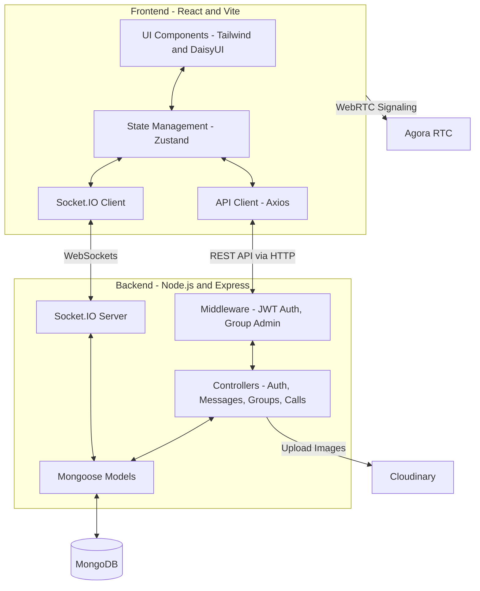

# chatApp
 Realtime Chat app MERN Stack
supports 1-1 chats and group chats and Calling
uses cloudinary,zustand,daisyui,axioa,socket,mongodb,multer


## Testing

The backend includes automated API tests using **Jest** and **Supertest**. The tests validate authentication rules, authorization middleware, and protected endpoints without requiring a database connection.

To run the API tests locally:
```bash
cd backend
npm test
```

## System Architecture

Below is a high-level overview of the application architecture, demonstrating how the frontend, backend, and external services interact.



### Architecture Highlights (For Recruiters & Engineers)

- **MERN Stack**: Built on MongoDB, Express.js, React, and Node.js. This ensures a unified language (JavaScript) across both the client and server.
- **Real-Time Communication**: Uses **Socket.IO** for instant 1-on-1 and group messaging. The WebSocket connection is secured with the same JWT authentication as the REST endpoints.
- **State Management**: Uses **Zustand** on the frontend for lightweight, fast, and unopinionated global state management (handling auth, chats, groups, themes, and calls).
- **Scalable Component Design**: The frontend is modularized into feature-specific components (e.g., `ChatContainer`, `Sidebar`, `CallModal`) and independent hooks to maintain readable and reusable code.
- **Media & Asset Management**: Integrates **Cloudinary** via `multer` for scalable image hosting (e.g., profile pictures and group icons) instead of storing large files directly in the database.
- **Video & Voice Calls**: Utilizes **Agora** for seamless, low-latency WebRTC video and voice communications.
- **Security & Authorization**: Features secure JWT-based authentication using HTTP-only cookies, password hashing with `bcryptjs`, and role-based middleware (e.g., Group Admin checks).
- **Test-Driven Reliability**: Includes automated backend API testing with **Jest** and **Supertest** to continuously validate authorization and business logic without fragile database dependencies.
